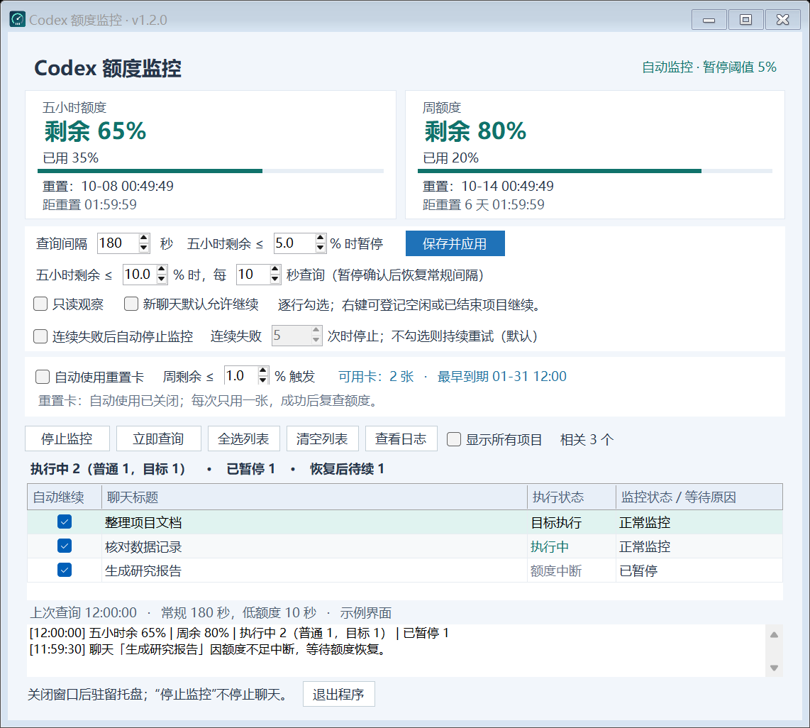

# Codex Quota Monitor · 额度监控器

Windows 桌面工具，显示 Codex 五小时和周额度，在额度低时暂停聊天，恢复后继续原任务。支持普通聊天、目标任务（Goal）、额度中断恢复和自动使用已有重置卡。中文界面，无需打开终端。

这是独立的非官方工具。读取的是 **Codex 额度**，不是普通 ChatGPT 对话的消息次数。



## 下载与使用

从 [最新发布](https://github.com/cat2mao/codex-quota-monitor/releases/latest) 下载 `CodexQuotaMonitor.exe`，双击运行。也可下载 ZIP，包含 EXE、使用说明和许可证。

需要 Windows x64、.NET Framework 4.8、已安装并登录的 Codex 桌面客户端，以及 PowerShell 7。优先使用 Codex 自带的 PowerShell 7；也支持 PATH 中的 `pwsh.exe`。无需管理员权限。

首次运行默认：每 **30 秒**查询；五小时剩余 **≤10%** 时每 **10 秒**查询；剩余 **≤5%** 暂停；暂停确认后恢复常规查询间隔；新聊天默认允许恢复；自动重置卡和连续失败自动停止均 **关闭**。

- 每行“自动继续”都能直接取消或开启。对已有聊天的选择会保存，不受“新聊天默认允许继续”开关覆盖。
- 默认展示执行中、等待输入、目标待续、监控中、暂停等待恢复及需要排查的相关项目；勾选“显示所有项目”可查看本机未归档桌面项目，包含空闲、已结束和未加载项目。
- 状态示例：`执行中 2（普通 1，目标 1）`，两个分类已包含在总数中。目标在轮次之间空闲时另显示“目标待续”。
- 自动继续针对监控器登记的暂停或明确的额度中断。额度需超过暂停阈值，账号服务允许使用，周额度未耗尽，原任务身份未变化，无待处理输入，再通过两次检查（至少 5 秒）。
- 右键项目可手动暂停、开始/继续、登记自动继续或取消自动继续。主动登记允许空闲或已结束项目继续一次；原有勾选仅管理自动恢复许可。手动暂停保持暂停，需主动开始或重新登记。
- “已暂停”是确认暂停的数量；“恢复后待续”是已登记且允许继续的数量，不包含手动保持暂停、取消勾选的项目或未登记的历史项目。只读模式待续数为 0。
- 最小化或关闭窗口后驻留托盘；点“退出程序”才结束后台。“停止监控”不停止当前聊天。
- 界面可勾选“连续失败后自动停止监控”，自定义 1–9999 次；不勾选则持续重试，旧设置升级也默认关闭。成功查询后连续失败计数清零，失败时按常规查询间隔重试。

等待暂停或继续结果确认期间保留较短查询；没有实际执行中或活跃目标时，按常规间隔等待额度恢复，残留的空闲监控记录不会保持快速查询。若还有任务在执行，低额度加速仍生效。

数字设置修改后点 **保存并应用**；开关和聊天勾选自动保存。主卡片显示本轮查询返回的真实额度，每轮刷新查询进程以避免旧缓存；查询间隔是完成一轮之后的等待时间。倒计时每秒更新，额度百分比不在两次查询之间虚构变化。

## 重置卡

勾选“自动使用重置卡”，设置“周剩余 ≤X% 触发”，再保存。默认触发值 **1%**，可以自定义。卡片数量、最早到期时间和使用状态显示在窗口内。

只有自动监控模式、存在可用卡、达到周额度阈值时才请求使用一张。优先使用最早到期的可用 Codex 卡；仅知道数量时由服务选择。只读观察和测试模式不会使用卡。

服务器决定当时是否允许重置；返回“当前没有可重置额度”时不会显示成功。成功后重新查询五小时/周额度和卡数，不假定恢复到 100%。成功使用后若额度尚未回升，不会连续使用更多卡。

请求编号在发送前保存；超时或重启后沿用同一编号核实，防止重复消耗。结果待确认时至少间隔 30 秒；没有可重置窗口时，等待额度耗尽、窗口或卡数变化再检查。日志记录请求、服务器结果及重置后实际额度。

使用的是账号已有的 earned reset credits，不购买新卡或额度。接口依据 [官方 app-server 文档](https://learn.chatgpt.com/docs/app-server#8-earned-rate-limit-resets-chatgpt)。

## 额度中断与任务结束

`usageLimitExceeded` 错误或 `usageLimited` 目标会登记为“额度中断，等待恢复”，而不是“已完成”。额度恢复后按勾选规则继续，并要求先检查已有进度。旧记录即使被误标为结束，只要当前客户端仍明确报告同一额度中断，也可重新登记。

普通的 completed 状态表示 **本轮结束**，不能据此判断整个项目完成；默认不会重启，用户可右键主动登记继续。非额度错误显示“本轮失败”。用户修改原目标、发送新任务或手动接管会解除旧自动恢复资格；不会越过审批、用户输入或目标预算限制。

## 日志与文件位置

“查看日志”支持日期、聊天、内容和事件类型筛选，以及 CSV 导出。包含额度、暂停、继续、重置卡、异常、设置及启停。列表显示最近 2000 条匹配记录，导出包含全部匹配记录。按本机时间显示，旧日志缺失字段显示“未记录”。

设置：`%LOCALAPPDATA%\CodexQuotaMonitor\settings.json`；默认状态和日志：`%LOCALAPPDATA%\CodexQuotaMonitor\state`。后台脚本随 EXE 嵌入，运行时展开到同一 AppData 目录。程序不会把账号凭据、聊天内容、配置或日志上传到本仓库。

若从旧项目交付目录运行，会识别已有的 `work/quota-monitor-v1/all-Auto` 状态并保存该路径，后续换 EXE 位置仍可沿用。首次从其他目录升级时，旧路径尚未保存：先退出旧实例，参照 [迁移说明](docs/使用说明.md#升级与状态迁移) 保留原状态和日志。程序有实例互斥，旧监控需先退出。

## 构建与验证

在 PowerShell 7 中运行：

```powershell
.\test.ps1
.\build.ps1
```

产物：`dist\CodexQuotaMonitor.exe`。使用 Windows 自带的 .NET Framework C# 编译器，WinForms 界面和 PowerShell 后台，无需 NuGet 或 Node.js。

测试采用模拟服务，不消耗实际重置卡或控制实际聊天。包括 42 项基础判断、53 项功能判断、24 项项目操作检查、多聊天协调和并发文件读写。图形界面另外进行隔离只读验证，检查勾选、失败设置、相关/全部列表、右键菜单、额度更新、日志及退出。详见 [验证说明](docs/验证说明.md)。

额度读取和重置卡使用 app-server，既有桌面聊天控制使用本机 IPC。客户端内部协议可能变化；版本号只作展示。普通连接或读取错误按重试设置处理；身份不符、未知协议或提交结果无法确认时仍保留任务控制保护。暂停不保证终止聊天启动的所有外部进程。

MIT License。
